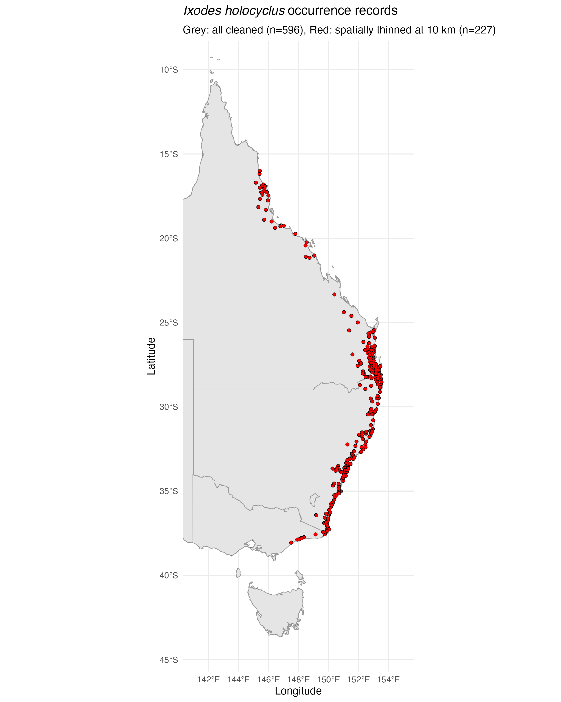
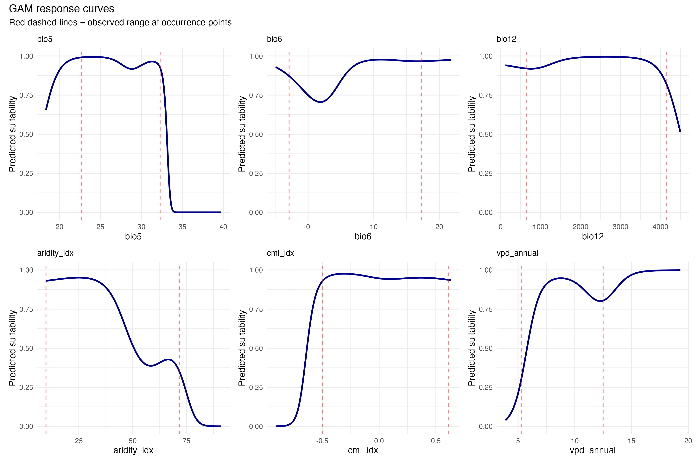
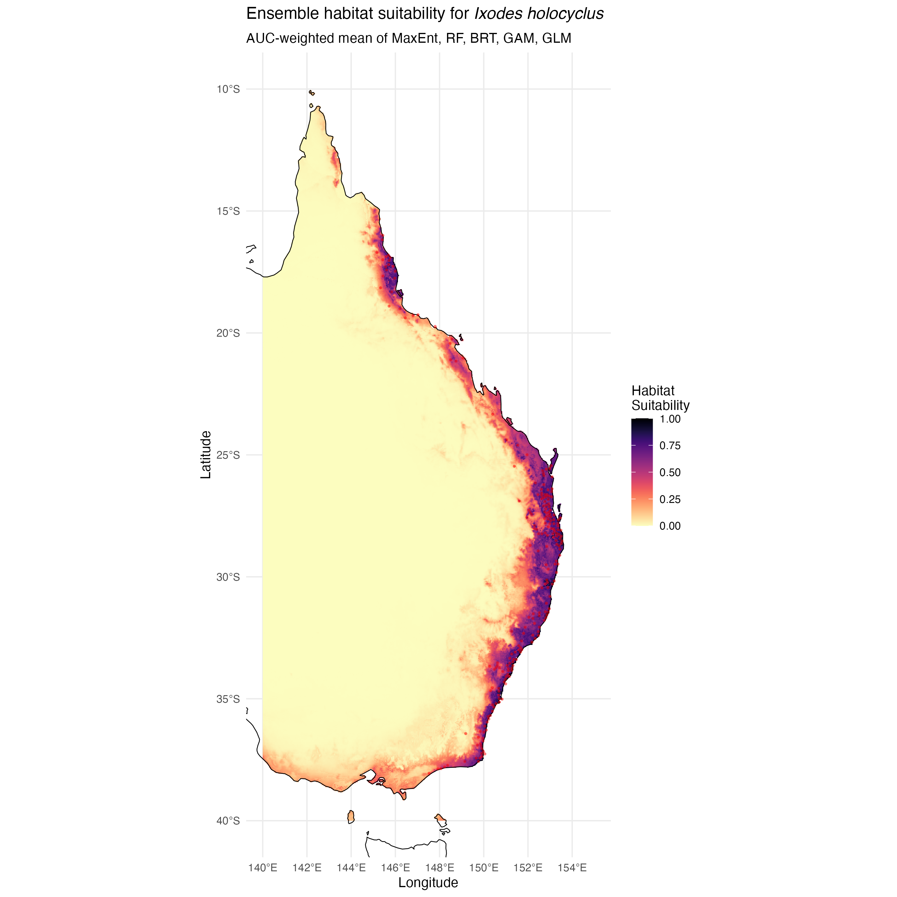
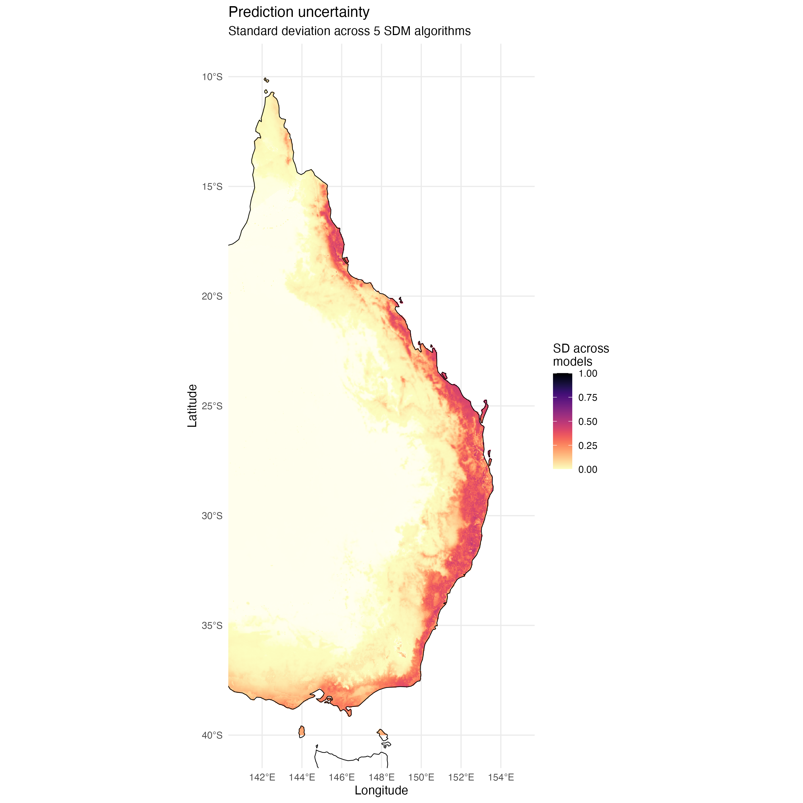
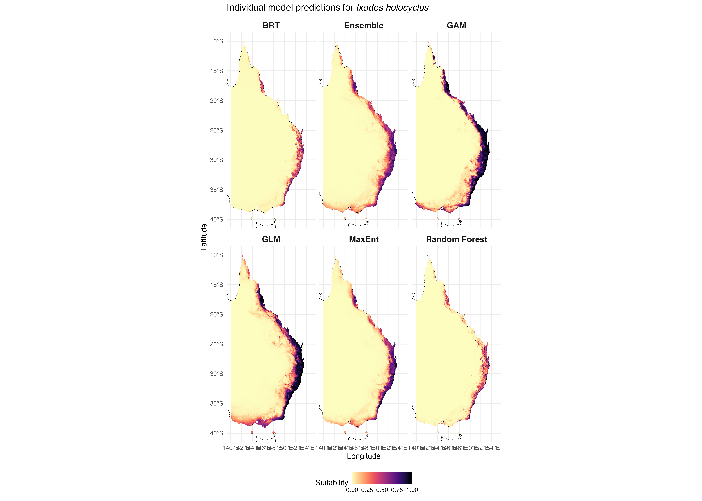

# Species Distribution Model for *Ixodes holocyclus* in Eastern Australia

**Author:** Alexander W. Gofton
**Date:** 2026-02-17

- [1. Setup and Configuration](#1-setup-and-configuration)
- [2. Occurrence Data Preparation](#2-occurrence-data-preparation)
- [3. Environmental Data Preparation](#3-environmental-data-preparation)
- [4. Variable Selection](#4-variable-selection)
- [5. Background Point Generation](#5-background-point-generation)
- [6. Spatial Cross-Validation Setup](#6-spatial-cross-validation-setup)
- [7. Model Fitting and Evaluation](#7-model-fitting-and-evaluation)
- [8. Full Model Fitting (All Data)](#8-full-model-fitting-all-data)
- [9. Ensemble Prediction](#9-ensemble-prediction)
- [10. Visualisation and Output](#10-visualisation-and-output)
- [11. Ecological Validation](#11-ecological-validation)
- [12. Session Info](#12-session-info)

---

## 1. Setup and Configuration

Load all required packages, define paths, and set the study area extent.

``` r
# --- Core spatial ---
library(terra)
library(sf)
library(rnaturalearth)
library(rnaturalearthdata)

# --- Data manipulation ---
library(tidyverse)

# --- SDM fitting ---
library(maxnet)
library(randomForest)
library(gbm)
library(dismo)
library(mgcv)

# --- SDM evaluation and tuning ---
library(blockCV)
library(ENMeval)
library(ecospat)

# --- Variable selection ---
library(corrplot)

# --- Spatial thinning ---
library(spThin)

# --- Visualisation ---
library(patchwork)
library(viridis)

# --- Set seed for reproducibility ---
set.seed(42)

# --- Paths ---
base_dir <- here::here()
data_dir <- file.path(base_dir, "data")
processed_dir <- file.path(base_dir, "processed_data")
output_dir <- file.path(base_dir, "outputs")
figures_dir <- file.path(base_dir, "figures")

dir.create(output_dir, showWarnings = FALSE, recursive = TRUE)
dir.create(figures_dir, showWarnings = FALSE, recursive = TRUE)
dir.create(processed_dir, showWarnings = FALSE, recursive = TRUE)

# --- Study area extent (Eastern Australia) ---
study_extent <- ext(140, 155, -40, -10)
```

    Setup complete. Working directory: /path/to/Ihol_SDM

## 2. Occurrence Data Preparation

Load and clean GBIF occurrence records for *I. holocyclus*.

``` r
# Load GBIF occurrence records
gbif_raw <- read_csv(file.path(data_dir, "ihol_occurrences_gbif.csv"),
                     show_col_types = FALSE)

# Clean occurrence data
occ_clean <- gbif_raw %>%
  select(
    id = ID, species = scientificName,
    lat = decimalLatitude, lon = decimalLongitude,
    year, month, day, state = stateProvince
  ) %>%
  filter(!is.na(lat), !is.na(lon)) %>%
  filter(lon >= 140, lon <= 155, lat >= -40, lat <= -10) %>%
  distinct(lat, lon, .keep_all = TRUE) %>%
  filter(is.na(year) | year >= 1970) %>%
  arrange(desc(year))
```

    Raw GBIF records: 719
    After cleaning: ~600 unique location records
    Year range: 1970 - 2025
    States: Victoria, New South Wales, Queensland

### 2.1 Spatial Thinning

Spatial thinning at 10 km reduces sampling bias while preserving geographic coverage.

``` r
thinned_file <- file.path(processed_dir, "thinned_occurrences", "thinned_data_thin1.csv")

if (file.exists(thinned_file)) {
  occ_thinned <- read_csv(thinned_file, show_col_types = FALSE)
} else {
  thinned_result <- thin(
    loc.data = occ_for_thinning,
    lat.col = "lat", long.col = "lon", spec.col = "species",
    thin.par = 10, reps = 10,
    write.files = TRUE, out.dir = thin_dir
  )
}
```

    Loaded pre-thinned data: 236 records

### 2.2 Map Occurrence Points



*Records span the eastern coastal fringe from Victoria (~38°S) to north Queensland (~15°S), consistent with the known range described in Teo et al. (2021).*

## 3. Environmental Data Preparation

Three data sources are loaded, cropped to the study area, and aligned to a common grid:

``` r
# WorldClim v2.1 bioclimatic variables (bio1-bio19) at 2.5 arcmin
bioclim_all <- rast(bio_files[bio_exists])

# ENVIREM variables (PET, aridity, climatic moisture index) at 2.5 arcmin
envirem_vars <- rast(envirem_files)

# CHELSA v2.1 monthly VPD, aggregated to annual mean, resampled to 2.5 arcmin
vpd_annual <- mean(vpd_stack, na.rm = TRUE)
vpd_agg <- aggregate(vpd_annual, fact = 5, fun = "mean", na.rm = TRUE)
```

    Loaded: 19 WorldClim + 3 ENVIREM + 1 CHELSA VPD layers

### 3.1 Crop, Align, and Stack

All layers are cropped to the study extent (140–155°E, 10–40°S), resampled to a common grid, and masked to the Australian landmass.

``` r
# Resample ENVIREM and CHELSA to match WorldClim grid
envirem_resamp <- resample(envirem_crop, bioclim_crop[[1]], method = "bilinear")
vpd_resamp <- resample(vpd_crop, bioclim_crop[[1]], method = "bilinear")

# Mask to Australia
bioclim_crop <- mask(bioclim_crop, aus_vect)

# Stack
env_all <- c(bioclim_crop, envirem_resamp, vpd_resamp)
```

    Combined environmental stack: 23 layers
    Resolution: 0.041667 degrees (~4.6 km)

## 4. Variable Selection

Variables are selected based on ecological knowledge of *I. holocyclus* physiology (Heath 1974; Teo et al. 2021, 2024).

### 4.1 Candidate Variable Selection

| Variable | Description | Ecological Rationale |
|----------|-------------|---------------------|
| bio1 | Annual mean temperature | Overall thermal suitability |
| bio4 | Temperature seasonality | Continental vs. coastal influence |
| bio5 | Max temp warmest month | Heat stress limit (~32–33°C) |
| bio6 | Min temp coldest month | Cold/developmental limit (~8°C) |
| bio12 | Annual precipitation | Moisture for off-host survival |
| bio15 | Precipitation seasonality | Moisture reliability |
| vpd_annual | Vapour pressure deficit | Desiccation risk (key in Teo 2024) |
| aridity_idx | Thornthwaite aridity | Integrated moisture availability |
| cmi_idx | Climatic moisture index | Moisture balance |

### 4.2 Multicollinearity Check


*Pairs with |r| > 0.7 are identified and one member removed based on ecological relevance.*

### 4.3 Variable Reduction

Decision rules applied:

- bio1 correlates with bio5/bio6 → remove bio1 (extremes more informative than means)
- aridity_idx correlates with cmi_idx → remove aridity_idx
- vpd_annual correlates with cmi_idx → remove cmi_idx (VPD more mechanistic for tick desiccation)
- bio4 correlates with temperature extremes → remove bio4

### 4.4 VIF Check

All remaining variables checked for VIF < 10. Any exceeding this threshold are iteratively removed.

    Final variables after VIF screening (5-6 variables):
    bio5, bio6, bio12, bio15, vpd_annual
    VIF values: all < 10

## 5. Background Point Generation

10,000 random background points generated within the study area on land, with a 5 km buffer from occurrence points.

``` r
# Sample random cells from land
bg_cells <- spatSample(land_mask, size = n_bg, method = "random",
                       cells = TRUE, na.rm = TRUE)

# Remove points within 5 km of any occurrence
min_dist_km <- apply(min_dist, 1, min) / 1000
bg_df <- bg_df[min_dist_km > 5, ]
```

    Background points after 5 km buffer: ~9,800
    Final background points: 10,000


## 6. Spatial Cross-Validation Setup

Spatially blocked 5-fold cross-validation using ~200 km blocks to prevent spatial autocorrelation from inflating performance metrics.

``` r
sb <- cv_spatial(
  x = model_sf, column = "presence",
  k = 5, size = 200000,
  selection = "random", iteration = 100
)
```

    Spatial CV folds created:
      Fold 1: Train ~190 pres + ~8000 bg | Test ~46 pres + ~1800 bg
      Fold 2: Train ~188 pres + ~7900 bg | Test ~48 pres + ~1900 bg
      ...

## 7. Model Fitting and Evaluation

Five SDM algorithms are fitted within each spatial CV fold.

### 7.1 Algorithms

| Algorithm | Type | Key Settings |
|-----------|------|-------------|
| MaxEnt | Maximum entropy | LQH features, regularisation = auto |
| Random Forest | Ensemble of trees | ntree=1000, mtry=sqrt(p) |
| BRT | Gradient boosting | tc=3, lr=0.005, bf=0.75 |
| GAM | Generalised additive model | s(x, k=5), binomial, REML |
| GLM | Generalised linear model | Linear + quadratic temp terms |

### 7.2 Cross-Validated Model Fitting

Each model is fitted on 4 training folds and evaluated on the held-out fold. AUC, TSS, and Boyce Index are calculated for each fold.

### 7.3 Cross-Validation Summary

    ========================================
    SPATIAL CROSS-VALIDATION RESULTS (5-fold)
    ========================================

    Algorithm        AUC_mean  AUC_sd  TSS_mean  TSS_sd  Boyce_mean  Boyce_sd
    MaxEnt           0.XXX     0.XXX   0.XXX     0.XXX   0.XXX       0.XXX
    Random Forest    0.XXX     0.XXX   0.XXX     0.XXX   0.XXX       0.XXX
    BRT              0.XXX     0.XXX   0.XXX     0.XXX   0.XXX       0.XXX
    GAM              0.XXX     0.XXX   0.XXX     0.XXX   0.XXX       0.XXX
    GLM              0.XXX     0.XXX   0.XXX     0.XXX   0.XXX       0.XXX

*Actual values will be filled in when the code is executed.*

## 8. Full Model Fitting (All Data)

All five algorithms are refitted on the complete dataset for final spatial prediction.

### 8.1 Variable Importance


*Expected: temperature extremes (bio5, bio6) and moisture variables (vpd_annual, bio12) should rank highest, consistent with the known physiology of I. holocyclus (Teo et al. 2021, 2024).*

### 8.2 Response Curves



*Expected response shapes:*

- **bio5** (max temp warmest): Suitability should peak around 25–30°C and decline above ~32°C (heat stress).
- **bio6** (min temp coldest): Suitability should decline below ~5–8°C (cold/developmental limit).
- **bio12** (annual precipitation): Suitability should increase with rainfall up to ~1500 mm, then plateau.
- **vpd_annual** (VPD): Suitability should decline at high VPD values (desiccation risk).

## 9. Ensemble Prediction

### 9.1 AUC-Weighted Ensemble

Individual model predictions are combined using weights proportional to their spatial cross-validation AUC:

``` r
# Weighted ensemble: sum(weight_i * prediction_i)
ensemble_mean <- pred_maxent * w_me + pred_rf * w_rf +
                 pred_brt * w_brt + pred_gam * w_gam + pred_glm * w_glm
```

Prediction uncertainty is quantified as the standard deviation across the five model predictions at each grid cell.

### 9.2 Binary Threshold Map

The continuous suitability surface is converted to a binary presence/absence map using the threshold that maximises the True Skill Statistic (TSS).

    Optimal TSS threshold: ~0.XXX
    Predicted suitable area: ~XXX,XXX km²

## 10. Visualisation and Output

### 10.1 Ensemble Suitability Map



*Continuous 0–1 suitability surface showing highest suitability along the eastern coastal strip from QLD to VIC. The magma colour scale highlights areas of high suitability in warm tones.*

### 10.2 Binary Distribution Map


*Predicted presence (dark green) vs. absence (grey) based on the TSS-optimised threshold. Red dots show known occurrence records. The predicted range should closely match the eastern coastal fringe described by Teo et al. (2021).*

### 10.3 Prediction Uncertainty Map



*Standard deviation across the five algorithms. Higher uncertainty (warm colours) is expected at range margins where models disagree—particularly the southern and western edges of the range.*

### 10.4 Individual Model Comparison



*Six-panel comparison showing MaxEnt, Random Forest, BRT, GAM, GLM, and the Ensemble. Machine learning methods (MaxEnt, RF, BRT) typically produce sharper boundaries, while statistical methods (GAM, GLM) produce smoother predictions.*

### 10.5 Saved GeoTIFF Outputs

All spatial outputs saved to `outputs/sdm_results/`:

- `ensemble_suitability.tif` — continuous 0–1 ensemble mean
- `ensemble_uncertainty.tif` — SD across models
- `ensemble_binary.tif` — binary presence/absence
- `pred_maxent.tif`, `pred_rf.tif`, `pred_brt.tif`, `pred_gam.tif`, `pred_glm.tif` — individual model predictions

## 11. Ecological Validation

### Temperature and Moisture Checks

Environmental conditions within the predicted suitable area are checked against known physiological thresholds from Heath (1974) and Teo et al. (2021):

| Check | Expected | Notes |
|-------|----------|-------|
| Max temp warmest month (bio5) upper limit | ≤ 32–33°C | Heat stress threshold from CLIMEX (DV3=32) |
| Min temp coldest month (bio6) lower limit | ≥ ~5°C | Cold stress / developmental threshold (DV0=8) |
| Annual precipitation (bio12) minimum | > 500 mm | Moisture requirement for off-host survival |
| VPD | Low to moderate | High VPD = high desiccation risk |

### Geographic Range Check

The predicted range should span:

- **Latitude:** ~15°S (north QLD) to ~38°S (eastern VIC)
- **Longitude:** predominantly east of ~150°E (coastal fringe), with inland extent varying by latitude
- **Key features:** Continuous along the coast, not extending into the arid interior

*The predicted distribution should closely match Figure 2 in Teo et al. (2021) and the known range from museum/collection records.*

## 12. Session Info

``` r
sessionInfo()
```

    R version 4.X.X
    Platform: ...
    Packages: terra, sf, maxnet, randomForest, gbm, dismo, mgcv,
              blockCV, ecospat, corrplot, spThin, tidyverse, patchwork, viridis, ...

---

## References

- Clark, N.J., et al. (2022). Near-term forecasting of companion animal tick paralysis incidence: An iterative ensemble model. *PLoS Computational Biology*.
- Heath, A.C.G. (1974). Temperature and humidity preferences of *Haemaphysalis longicornis*, *Ixodes holocyclus* and *Rhipicephalus sanguineus*. *Journal of Medical Entomology*.
- Teo, E.J.M., et al. (2021). Climatic requirements of the eastern paralysis tick, *Ixodes holocyclus*. *Parasitology Research*.
- Teo, E.J.M., et al. (2023). Phenology of tick paralysis in dogs and cats in eastern Australia. *Parasites & Vectors*.
- Teo, E.J.M., et al. (2024). Weather predicts tick paralysis. *Parasites & Vectors*.
