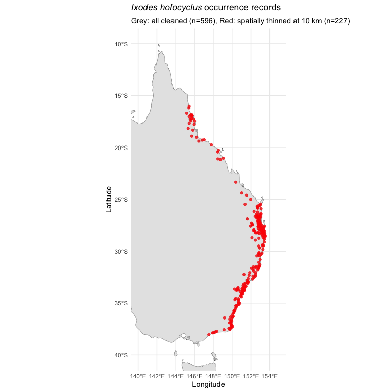

# 01 Occurrence Data Preparation
Alexander W. Gofton
2026-02-18

- [1. Setup and Configuration](#1-setup-and-configuration)
- [2. Occurrence Data Preparation](#2-occurrence-data-preparation)
  - [2.1 Spatial Thinningdown](#21-spatial-thinningdown)
  - [2.2 Map Occurrence Points](#22-map-occurrence-points)

# 1. Setup and Configuration

``` r
# --- Core spatial ---
library(terra)
library(sf)
library(rnaturalearth)
library(rnaturalearthdata)

# --- Data manipulation ---
library(tidyverse)

# --- SDM fitting ---
#library(maxnet)
#library(randomForest)
#library(gbm)
#library(dismo)
#library(mgcv)

# --- SDM evaluation and tuning ---
#library(blockCV)
#library(ENMeval)
#library(ecospat)

# --- Variable selection ---
#library(corrplot)

# --- Spatial thinning ---
library(spThin)

# --- Visualisation ---
library(patchwork)
library(viridis)

# --- Set seed for reproducibility ---
set.seed(7990)

# --- Paths ---
base_dir <- "/Users/gof005/Library/CloudStorage/OneDrive-CSIRO/OneDrive - Docs/01_Projects/alpha_gal/02_SAP_2025-6/Ihol_SDM"
data_dir <- file.path(base_dir, "data")
processed_dir <- file.path(base_dir, "processed_data")
output_dir <- file.path(base_dir, "outputs")
figures_dir <- file.path(base_dir, "figures")


# --- Study area extent (Eastern Australia) ---
study_extent <- ext(140, 155, -40, -10)
```

# 2. Occurrence Data Preparation

``` r
# Load GBIF occurrence records
gbif_raw <- read_csv(file.path(data_dir, "ihol_occurrences_gbif.csv"),
                     show_col_types = FALSE)

cat("Raw GBIF records:", nrow(gbif_raw), "\n")

# Clean occurrence data
occ_clean <- gbif_raw %>%
  # Select and rename key columns
  select(
    id = ID,
    species = scientificName,
    lat = decimalLatitude,
    lon = decimalLongitude,
    year, month, day,
    state = stateProvince
  ) %>%
  # Remove records without coordinates
  filter(!is.na(lat), !is.na(lon)) %>%
  # Restrict to study area
  filter(lon >= 140, lon <= 155, lat >= -40, lat <= -10) %>%
  # Remove exact duplicate coordinates
  distinct(lat, lon, .keep_all = TRUE) %>%
  # Optionally filter to post-1970 to match WorldClim climate normals
  filter(is.na(year) | year >= 1970) %>%
  arrange(desc(year))

cat("After cleaning:", nrow(occ_clean), "unique location records\n")
cat("Year range:", min(occ_clean$year, na.rm = TRUE), "-",
    max(occ_clean$year, na.rm = TRUE), "\n")
cat("States:", paste(unique(occ_clean$state), collapse = ", "), "\n")
```

    Raw GBIF records: 720 
    After cleaning: 596 unique location records
    Year range: 1970 - 2025 
    States: Victoria, New South Wales, Queensland, Jervis Bay Territory, NA 

## 2.1 Spatial Thinningdown

Spatial thinning reduces the influence of sampling bias by ensuring a
minimum distance between retained points. We use 10 km, consistent with
our ~5 km grid resolution.

``` r
# Check if thinned data already exists
thinned_file <- file.path(processed_dir, "thinned_occurrences", "thinned_data_thin1.csv")

if (file.exists(thinned_file)) {
  occ_thinned <- read_csv(thinned_file, show_col_types = FALSE)
  # Standardise column names
  if ("Longitude" %in% names(occ_thinned)) {
    occ_thinned <- occ_thinned %>% rename(lon = Longitude, lat = Latitude)
  }
  cat("Loaded pre-thinned data:", nrow(occ_thinned), "records\n")
} else {
  # Perform spatial thinning at 10 km
  occ_for_thinning <- occ_clean %>%
    mutate(species = "I_holocyclus")

  thin_dir <- file.path(processed_dir, "thinned_occurrences")
  dir.create(thin_dir, showWarnings = FALSE, recursive = TRUE)

  thinned_result <- thin(
    loc.data = occ_for_thinning,
    lat.col = "lat",
    long.col = "lon",
    spec.col = "species",
    thin.par = 10,
    reps = 10,
    write.files = TRUE,
    out.dir = thin_dir,
    write.log.file = FALSE
  )

  # Use the replicate with the most records
  best_rep <- which.max(sapply(thinned_result, nrow))
  occ_thinned <- thinned_result[[best_rep]]
  cat("Thinned from", nrow(occ_clean), "to", nrow(occ_thinned), "records (10 km)\n")
}
```

    Loaded pre-thinned data: 227 records

## 2.2 Map Occurrence Points

``` r
# Get Australia coastline
aus <- ne_countries(scale = "medium", country = "Australia", returnclass = "sf")

# Map all cleaned and thinned occurrence points
p_occ <- ggplot() +
  geom_sf(data = aus, fill = "grey90", colour = "grey40") +
  geom_point(data = occ_clean,
             aes(x = lon, y = lat),
             colour = "grey60", size = 1, alpha = 0.5) +
  geom_point(data = occ_thinned,
             aes(x = lon, y = lat),
             colour = "red", size = 1.5, alpha = 0.7) +
  coord_sf(xlim = c(140, 155), ylim = c(-40, -10)) +
  labs(
    title = expression(italic("Ixodes holocyclus") ~ "occurrence records"),
    subtitle = paste0("Grey: all cleaned (n=", nrow(occ_clean),
                      "), Red: spatially thinned at 10 km (n=", nrow(occ_thinned), ")"),
    x = "Longitude", y = "Latitude"
  ) +
  theme_minimal()

print(p_occ)
```



``` r
ggsave(file.path(figures_dir, "01_occurrence_map.png"), p_occ,
       width = 8, height = 8, dpi = 300)
```
