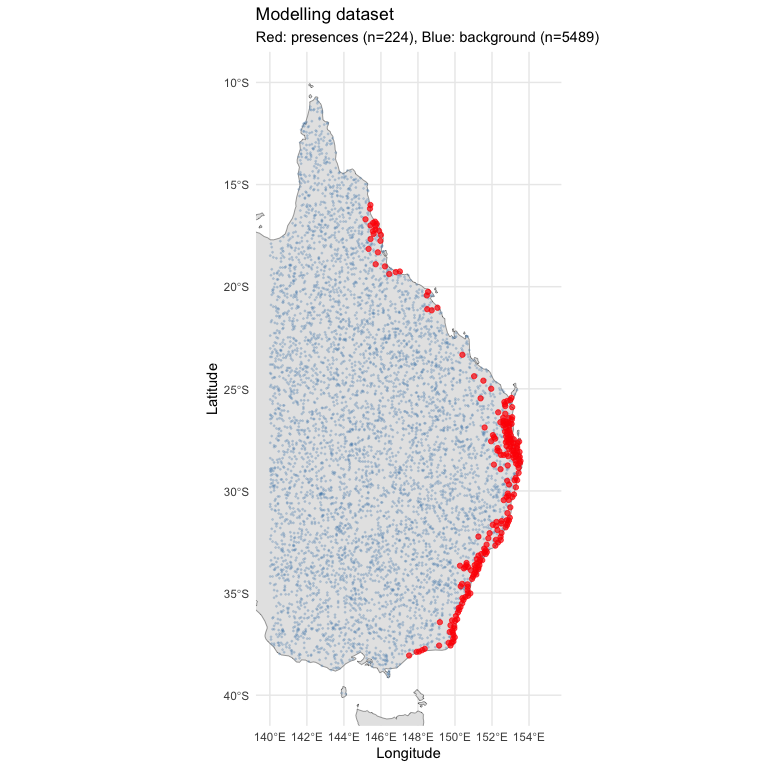
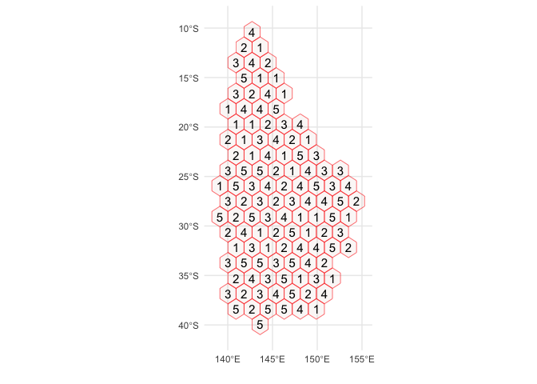

# 03 Background Point Generation
Alexander W. Gofton
2026-02-18

- [1. Setup and Configuration](#1-setup-and-configuration)
- [2. Load Outputs from Previous
  Scripts](#2-load-outputs-from-previous-scripts)
- [5. Background Point Generation](#5-background-point-generation)
  - [5.1 Extract Environmental Values and Build Modelling
    Dataset](#51-extract-environmental-values-and-build-modelling-dataset)
  - [5.2 Map Presence and Background
    Points](#52-map-presence-and-background-points)
- [6. Spatial Cross-Validation Setup](#6-spatial-cross-validation-setup)
- [7. Model Fitting and Evaluation](#7-model-fitting-and-evaluation)
  - [7.1 Helper Functions](#71-helper-functions)
  - [7.2 Cross-Validated Model
    Fitting](#72-cross-validated-model-fitting)
  - [7.3 Cross-Validation Summary](#73-cross-validation-summary)
- [8. Save Outputs for Downstream
  Scripts](#8-save-outputs-for-downstream-scripts)

# 1. Setup and Configuration

``` r
# --- Core spatial ---
library(terra)
library(sf)
library(rnaturalearth)
library(rnaturalearthdata)

# --- Data manipulation ---
library(tidyverse)

# --- SDM fitting ---
library(maxnet)
library(randomForest)
library(gbm)
library(dismo)
library(mgcv)

# --- SDM evaluation and tuning ---
library(blockCV)
library(ENMeval)
library(ecospat)

# --- Variable selection ---
library(corrplot)

# --- Spatial thinning ---
library(spThin)

# --- Visualisation ---
library(patchwork)
library(viridis)

# --- Set seed for reproducibility ---
set.seed(7990)

# --- Paths ---
base_dir <- "/Users/gof005/Library/CloudStorage/OneDrive-CSIRO/OneDrive - Docs/01_Projects/alpha_gal/02_SAP_2025-6/Ihol_SDM"
data_dir <- file.path(base_dir, "data")
processed_dir <- file.path(base_dir, "processed_data")
output_dir <- file.path(base_dir, "outputs")
figures_dir <- file.path(base_dir, "figures")


# --- Study area extent (Eastern Australia) ---
study_extent <- ext(140, 155, -40, -10)
```

# 2. Load Outputs from Previous Scripts

``` r
# --- From 02_env_vars.qmd ---
env_model  <- rast(file.path(output_dir, "env_layers", "env_model.tif"))
final_vars <- readRDS(file.path(output_dir, "env_layers", "final_vars.rds"))

# --- From 01_occurrences.qmd ---
occ_thinned <- read.csv(file.path(processed_dir, "thinned_occurrences", "thinned_data_thin1.csv"))

cat("env_model layers (", nlyr(env_model), "):", paste(final_vars, collapse = ", "), "\n")
cat("Occurrence points loaded:", nrow(occ_thinned), "\n")
```

    env_model layers ( 6 ): bio5, bio6, bio12, aridity_idx, cmi_idx, vpd_annual 
    Occurrence points loaded: 227 

# 5. Background Point Generation

We generate background points (pseudo-absences) for model fitting. These
represent the available environmental conditions within the study area.

``` r
# Generate random background points within the study area, on land
n_bg <- 10000

# Use the first environmental layer as a template (non-NA = land)
land_mask <- !is.na(env_model[[1]])

# Sample random cells from land
bg_cells <- spatSample(land_mask, size = n_bg, method = "random",
                       cells = TRUE, na.rm = TRUE)

bg_coords <- xyFromCell(env_model, bg_cells$cell)
bg_df <- as.data.frame(bg_coords)
names(bg_df) <- c("lon", "lat")

# Remove background points within 5 km of any occurrence point
occ_sf_pts <- st_as_sf(occ_thinned, coords = c("lon", "lat"), crs = 4326)
bg_sf_pts <- st_as_sf(bg_df, coords = c("lon", "lat"), crs = 4326)

# Calculate minimum distance from each background point to nearest occurrence
# Using a 5 km buffer (~0.045 degrees)
min_dist <- st_distance(bg_sf_pts, occ_sf_pts)
min_dist_km <- apply(min_dist, 1, min) / 1000  # Convert metres to km

bg_df <- bg_df[min_dist_km > 5, ]
cat("Background points after 5 km buffer:", nrow(bg_df), "\n")

# Trim to target number if we have too many
if (nrow(bg_df) > n_bg) {
  bg_df <- bg_df[sample(nrow(bg_df), n_bg), ]
}

cat("Final background points:", nrow(bg_df), "\n")
```

    Background points after 5 km buffer: 9967 
    Final background points: 9967 

## 5.1 Extract Environmental Values and Build Modelling Dataset

``` r
# Extract environmental values at occurrence points
occ_vect <- vect(occ_thinned, geom = c("lon", "lat"), crs = "EPSG:4326")
occ_env_vals <- terra::extract(env_model, occ_vect)
occ_env_vals <- data.frame(
  presence = 1,
  lon = occ_thinned$lon,
  lat = occ_thinned$lat,
  occ_env_vals[, -1]  # Remove ID column
)

# Extract at background points
bg_vect <- vect(bg_df, geom = c("lon", "lat"), crs = "EPSG:4326")
bg_env_vals <- terra::extract(env_model, bg_vect)
bg_env_vals <- data.frame(
  presence = 0,
  lon = bg_df$lon,
  lat = bg_df$lat,
  bg_env_vals[, -1]
)

# Combine into single modelling dataset
model_data <- rbind(occ_env_vals, bg_env_vals)
model_data <- model_data[complete.cases(model_data), ]

cat("Modelling dataset: ", sum(model_data$presence == 1), "presences +",
    sum(model_data$presence == 0), "background =",
    nrow(model_data), "total\n")
```

    Modelling dataset:  224 presences + 5489 background = 5713 total

## 5.2 Map Presence and Background Points

``` r
p_points <- ggplot() +
  geom_sf(data = ne_countries(country = "Australia", scale = "medium", returnclass = "sf"),
          fill = "grey90", colour = "grey40") +
  geom_point(data = model_data %>% filter(presence == 0),
             aes(x = lon, y = lat),
             colour = "steelblue", size = 0.3, alpha = 0.2) +
  geom_point(data = model_data %>% filter(presence == 1),
             aes(x = lon, y = lat),
             colour = "red", size = 1.5, alpha = 0.7) +
  coord_sf(xlim = c(140, 155), ylim = c(-40, -10)) +
  labs(
    title = "Modelling dataset",
    subtitle = paste0("Red: presences (n=", sum(model_data$presence == 1),
                      "), Blue: background (n=", sum(model_data$presence == 0), ")"),
    x = "Longitude", y = "Latitude"
  ) +
  theme_minimal()

print(p_points)
```



# 6. Spatial Cross-Validation Setup

We use spatially-blocked cross-validation to avoid inflated accuracy
metrics caused by spatial autocorrelation.

``` r
# Convert modelling data to sf
model_sf <- st_as_sf(model_data, coords = c("lon", "lat"), crs = 4326)

# Create spatial blocks for cross-validation
# Block size should approximate the spatial autocorrelation range
# For tick distributions at this scale, ~200 km is reasonable
sb <- cv_spatial(
  x = model_sf,
  column = "presence",
  k = 5,
  size = 200000,  # 200 km in metres
  selection = "random",
  iteration = 100,
  progress = FALSE
)
```



``` r
cat("Spatial CV folds created:\n")
for (i in 1:5) {
  n_train_pres <- sum(model_data$presence[sb$folds_list[[i]][[1]]] == 1)
  n_train_bg <- sum(model_data$presence[sb$folds_list[[i]][[1]]] == 0)
  n_test_pres <- sum(model_data$presence[sb$folds_list[[i]][[2]]] == 1)
  n_test_bg <- sum(model_data$presence[sb$folds_list[[i]][[2]]] == 0)
  cat(sprintf("  Fold %d: Train %d pres + %d bg | Test %d pres + %d bg\n",
              i, n_train_pres, n_train_bg, n_test_pres, n_test_bg))
}
```


      train_0 train_1 test_0 test_1
    1    4430     187   1059     37
    2    4395     187   1094     37
    3    4456     185   1033     39
    4    4301     195   1188     29
    5    4374     142   1115     82
    Spatial CV folds created:
      Fold 1: Train 187 pres + 4430 bg | Test 37 pres + 1059 bg
      Fold 2: Train 187 pres + 4395 bg | Test 37 pres + 1094 bg
      Fold 3: Train 185 pres + 4456 bg | Test 39 pres + 1033 bg
      Fold 4: Train 195 pres + 4301 bg | Test 29 pres + 1188 bg
      Fold 5: Train 142 pres + 4374 bg | Test 82 pres + 1115 bg

# 7. Model Fitting and Evaluation

## 7.1 Helper Functions

``` r
# Function to calculate AUC
calc_auc <- function(obs, pred) {
  # obs: 0/1 vector, pred: predicted probabilities
  n1 <- sum(obs == 1)
  n0 <- sum(obs == 0)
  if (n1 == 0 | n0 == 0) return(NA)

  ranks <- rank(pred)
  auc <- (sum(ranks[obs == 1]) - n1 * (n1 + 1) / 2) / (n1 * n0)
  return(auc)
}

# Function to calculate TSS (at threshold maximising TSS)
calc_tss <- function(obs, pred, n_thresholds = 100) {
  thresholds <- seq(min(pred), max(pred), length.out = n_thresholds)
  tss_vals <- sapply(thresholds, function(t) {
    pred_bin <- ifelse(pred >= t, 1, 0)
    tp <- sum(pred_bin == 1 & obs == 1)
    fn <- sum(pred_bin == 0 & obs == 1)
    fp <- sum(pred_bin == 1 & obs == 0)
    tn <- sum(pred_bin == 0 & obs == 0)
    sensitivity <- tp / (tp + fn)
    specificity <- tn / (tn + fp)
    tss <- sensitivity + specificity - 1
    return(tss)
  })
  best_idx <- which.max(tss_vals)
  return(list(tss = tss_vals[best_idx], threshold = thresholds[best_idx]))
}

# Function to calculate Boyce Index
calc_boyce <- function(obs, pred) {
  tryCatch({
    bi <- ecospat.boyce(fit = pred, obs = pred[obs == 1],
                        nclass = 0, window.w = "default", res = 100,
                        PEplot = FALSE)
    return(bi$cor)
  }, error = function(e) return(NA))
}
```

## 7.2 Cross-Validated Model Fitting

``` r
# Prepare storage for CV results
cv_results <- list()

# Predictor columns
pred_cols <- final_vars

for (fold_i in 1:5) {

  cat("\n=== Fold", fold_i, "===\n")

  train_idx <- sb$folds_list[[fold_i]][[1]]
  test_idx <- sb$folds_list[[fold_i]][[2]]

  train_data <- model_data[train_idx, ]
  test_data <- model_data[test_idx, ]

  train_x <- as.data.frame(train_data[, pred_cols])
  test_x <- as.data.frame(test_data[, pred_cols])
  train_y <- train_data$presence
  test_y <- test_data$presence

  fold_results <- list()

  # --- 1. MaxEnt ---
  tryCatch({
    me_model <- maxnet(p = train_y, data = train_x,
                       maxnet.formula(p = train_y, data = train_x,
                                      classes = "lqh"))
    me_pred <- predict(me_model, test_x, type = "cloglog")
    fold_results$maxent <- list(
      auc = calc_auc(test_y, me_pred),
      tss = calc_tss(test_y, me_pred)$tss,
      boyce = calc_boyce(test_y, me_pred)
    )
    cat("  MaxEnt AUC:", round(fold_results$maxent$auc, 3), "\n")
  }, error = function(e) {
    cat("  MaxEnt failed:", e$message, "\n")
    fold_results$maxent <<- list(auc = NA, tss = NA, boyce = NA)
  })

  # --- 2. Random Forest ---
  tryCatch({
    rf_data <- cbind(presence = factor(train_y), train_x)
    rf_model <- randomForest(presence ~ ., data = rf_data,
                             ntree = 1000,
                             mtry = floor(sqrt(length(pred_cols))))
    rf_pred <- predict(rf_model, test_x, type = "prob")[, "1"]
    fold_results$rf <- list(
      auc = calc_auc(test_y, rf_pred),
      tss = calc_tss(test_y, rf_pred)$tss,
      boyce = calc_boyce(test_y, rf_pred)
    )
    cat("  Random Forest AUC:", round(fold_results$rf$auc, 3), "\n")
  }, error = function(e) {
    cat("  RF failed:", e$message, "\n")
    fold_results$rf <<- list(auc = NA, tss = NA, boyce = NA)
  })

  # --- 3. BRT (Boosted Regression Trees) ---
  tryCatch({
    brt_data <- cbind(presence = train_y, train_x)
    brt_model <- gbm.step(
      data = brt_data,
      gbm.x = which(names(brt_data) %in% pred_cols),
      gbm.y = 1,
      family = "bernoulli",
      tree.complexity = 3,
      learning.rate = 0.005,
      bag.fraction = 0.75,
      silent = TRUE,
      plot.main = FALSE
    )

    if (!is.null(brt_model)) {
      brt_pred <- predict(brt_model, test_x,
                          n.trees = brt_model$gbm.call$best.trees,
                          type = "response")
      fold_results$brt <- list(
        auc = calc_auc(test_y, brt_pred),
        tss = calc_tss(test_y, brt_pred)$tss,
        boyce = calc_boyce(test_y, brt_pred)
      )
      cat("  BRT AUC:", round(fold_results$brt$auc, 3), "\n")
    } else {
      # Try with lower learning rate
      brt_model <- gbm.step(
        data = brt_data,
        gbm.x = which(names(brt_data) %in% pred_cols),
        gbm.y = 1,
        family = "bernoulli",
        tree.complexity = 2,
        learning.rate = 0.001,
        bag.fraction = 0.75,
        silent = TRUE,
        plot.main = FALSE
      )
      if (!is.null(brt_model)) {
        brt_pred <- predict(brt_model, test_x,
                            n.trees = brt_model$gbm.call$best.trees,
                            type = "response")
        fold_results$brt <- list(
          auc = calc_auc(test_y, brt_pred),
          tss = calc_tss(test_y, brt_pred)$tss,
          boyce = calc_boyce(test_y, brt_pred)
        )
        cat("  BRT AUC:", round(fold_results$brt$auc, 3), "\n")
      } else {
        fold_results$brt <- list(auc = NA, tss = NA, boyce = NA)
        cat("  BRT: could not fit model\n")
      }
    }
  }, error = function(e) {
    cat("  BRT failed:", e$message, "\n")
    fold_results$brt <<- list(auc = NA, tss = NA, boyce = NA)
  })

  # --- 4. GAM ---
  tryCatch({
    gam_data <- cbind(presence = train_y, train_x)
    # Build formula with smooth terms
    smooth_terms <- paste0("s(", pred_cols, ", k = 5)")
    gam_formula <- as.formula(
      paste("presence ~", paste(smooth_terms, collapse = " + "))
    )
    gam_model <- gam(gam_formula, data = gam_data,
                     family = binomial(link = "logit"),
                     method = "REML")
    gam_pred <- predict(gam_model, test_x, type = "response")
    fold_results$gam <- list(
      auc = calc_auc(test_y, gam_pred),
      tss = calc_tss(test_y, gam_pred)$tss,
      boyce = calc_boyce(test_y, gam_pred)
    )
    cat("  GAM AUC:", round(fold_results$gam$auc, 3), "\n")
  }, error = function(e) {
    cat("  GAM failed:", e$message, "\n")
    fold_results$gam <<- list(auc = NA, tss = NA, boyce = NA)
  })

  # --- 5. GLM ---
  tryCatch({
    glm_data <- cbind(presence = train_y, train_x)
    # Linear + quadratic terms for temperature, linear for others
    temp_vars <- pred_cols[grepl("bio5|bio6", pred_cols)]
    other_vars <- setdiff(pred_cols, temp_vars)
    glm_terms <- c(
      other_vars,
      paste0("poly(", temp_vars, ", 2)")
    )
    glm_formula <- as.formula(
      paste("presence ~", paste(glm_terms, collapse = " + "))
    )
    glm_model <- glm(glm_formula, data = glm_data,
                     family = binomial(link = "logit"))
    glm_pred <- predict(glm_model, test_x, type = "response")
    fold_results$glm <- list(
      auc = calc_auc(test_y, glm_pred),
      tss = calc_tss(test_y, glm_pred)$tss,
      boyce = calc_boyce(test_y, glm_pred)
    )
    cat("  GLM AUC:", round(fold_results$glm$auc, 3), "\n")
  }, error = function(e) {
    cat("  GLM failed:", e$message, "\n")
    fold_results$glm <<- list(auc = NA, tss = NA, boyce = NA)
  })

  cv_results[[fold_i]] <- fold_results
}
```


    === Fold 1 ===
      MaxEnt AUC: 0.975 
      Random Forest AUC: 0.975 
      BRT AUC: 0.973 
      GAM AUC: 0.973 
      GLM AUC: 0.975 

    === Fold 2 ===
      MaxEnt AUC: 0.973 
      Random Forest AUC: 0.973 
      BRT AUC: 0.978 
      GAM AUC: 0.969 
      GLM AUC: 0.969 

    === Fold 3 ===
      MaxEnt AUC: 0.951 
      Random Forest AUC: 0.948 
      BRT AUC: 0.945 
      GAM AUC: 0.955 
      GLM AUC: 0.951 

    === Fold 4 ===
      MaxEnt AUC: 0.985 
      Random Forest AUC: 0.973 
      BRT AUC: 0.962 
      GAM AUC: 0.985 
      GLM AUC: 0.984 

    === Fold 5 ===
      MaxEnt AUC: 0.954 
      Random Forest AUC: 0.951 
      BRT AUC: 0.952 
      GAM AUC: 0.956 
      GLM AUC: 0.95 

## 7.3 Cross-Validation Summary

``` r
# Compile CV results into a data frame
algorithms <- c("maxent", "rf", "brt", "gam", "glm")
algo_names <- c("MaxEnt", "Random Forest", "BRT", "GAM", "GLM")

cv_summary <- data.frame(
  Algorithm = algo_names,
  AUC_mean = NA, AUC_sd = NA,
  TSS_mean = NA, TSS_sd = NA,
  Boyce_mean = NA, Boyce_sd = NA
)

for (i in seq_along(algorithms)) {
  alg <- algorithms[i]
  auc_vals <- sapply(cv_results, function(f) f[[alg]]$auc)
  tss_vals <- sapply(cv_results, function(f) f[[alg]]$tss)
  boyce_vals <- sapply(cv_results, function(f) f[[alg]]$boyce)

  cv_summary$AUC_mean[i] <- round(mean(auc_vals, na.rm = TRUE), 3)
  cv_summary$AUC_sd[i] <- round(sd(auc_vals, na.rm = TRUE), 3)
  cv_summary$TSS_mean[i] <- round(mean(tss_vals, na.rm = TRUE), 3)
  cv_summary$TSS_sd[i] <- round(sd(tss_vals, na.rm = TRUE), 3)
  cv_summary$Boyce_mean[i] <- round(mean(boyce_vals, na.rm = TRUE), 3)
  cv_summary$Boyce_sd[i] <- round(sd(boyce_vals, na.rm = TRUE), 3)
}

cat("\n========================================\n")
cat("SPATIAL CROSS-VALIDATION RESULTS (5-fold)\n")
cat("========================================\n\n")
print(cv_summary, row.names = FALSE)

# Save CV summary
write_csv(cv_summary, file.path(output_dir, "cv_performance_summary.csv"))
```


    ========================================
    SPATIAL CROSS-VALIDATION RESULTS (5-fold)
    ========================================

         Algorithm AUC_mean AUC_sd TSS_mean TSS_sd Boyce_mean Boyce_sd
            MaxEnt    0.968  0.014    0.881  0.059      0.711    0.174
     Random Forest    0.964  0.014    0.857  0.054      0.559    0.168
               BRT    0.962  0.014    0.838  0.058      0.519    0.152
               GAM    0.967  0.012    0.873  0.062      0.558    0.173
               GLM    0.966  0.015    0.871  0.068      0.662    0.145

# 8. Save Outputs for Downstream Scripts

``` r
bg_out_dir <- file.path(output_dir, "bg_model_inputs")
dir.create(bg_out_dir, recursive = TRUE, showWarnings = FALSE)

# Modelling dataset (presence/background with env values)
saveRDS(model_data,    file.path(bg_out_dir, "model_data.rds"))

# Raw occurrence table (lon/lat) used in maps
saveRDS(occ_thinned,   file.path(bg_out_dir, "occ_thinned.rds"))

# SpatVectors for occurrence and background points
# Recreate from source data to avoid invalid external pointer after caching
writeVector(vect(occ_thinned, geom = c("lon", "lat"), crs = "EPSG:4326"),
            file.path(bg_out_dir, "occ_vect.gpkg"), overwrite = TRUE)
writeVector(vect(bg_df, geom = c("lon", "lat"), crs = "EPSG:4326"),
            file.path(bg_out_dir, "bg_vect.gpkg"),  overwrite = TRUE)

# Occurrence environmental values (used in response curves)
saveRDS(occ_env_vals,  file.path(bg_out_dir, "occ_env_vals.rds"))

# Predictor column names and algorithm labels
saveRDS(pred_cols,     file.path(bg_out_dir, "pred_cols.rds"))
saveRDS(algorithms,    file.path(bg_out_dir, "algorithms.rds"))
saveRDS(algo_names,    file.path(bg_out_dir, "algo_names.rds"))

# Helper functions needed in 04
saveRDS(list(calc_auc = calc_auc, calc_tss = calc_tss, calc_boyce = calc_boyce),
        file.path(bg_out_dir, "helper_functions.rds"))

cat("Saved to:", bg_out_dir, "\n")
cat("  model_data:      ", nrow(model_data), "rows\n")
cat("  occ_thinned:     ", nrow(occ_thinned), "rows\n")
cat("  pred_cols:       ", paste(pred_cols, collapse = ", "), "\n")
cat("  algorithms:      ", paste(algorithms, collapse = ", "), "\n")
```

    Saved to: /Users/gof005/Library/CloudStorage/OneDrive-CSIRO/OneDrive - Docs/01_Projects/alpha_gal/02_SAP_2025-6/Ihol_SDM/outputs/bg_model_inputs 
      model_data:       5713 rows
      occ_thinned:      227 rows
      pred_cols:        bio5, bio6, bio12, aridity_idx, cmi_idx, vpd_annual 
      algorithms:       maxent, rf, brt, gam, glm 
